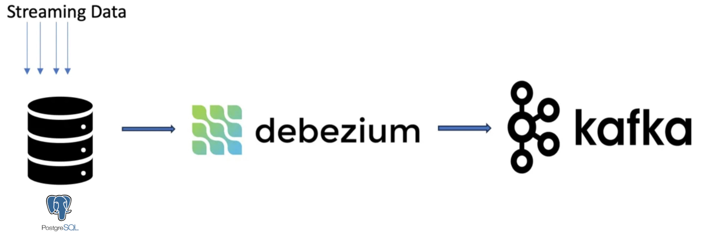

# CDC Pipeline: PostgreSQL - Debezium - Kafka

This project sets up a Change Data Capture (CDC) pipeline that streams data changes from PostgreSQL to Kafka using Debezium. The pipeline ensures that any changes in PostgreSQL tables are captured and sent to Kafka topics in real-time.

## Project Overview

The setup includes:
- **PostgreSQL**: The source database where data changes are captured.
- **Debezium**: A CDC tool that captures changes from PostgreSQL and publishes them to Kafka.
- **Kafka**: Acts as the data streaming platform, receiving and holding data from Debezium for downstream consumers.

## Architecture Diagram

Below is a visual representation of the CDC pipeline:



## Quickstart Commands

1. **Start the Docker Containers**

   Bring up all services (PostgreSQL, Kafka, Zookeeper, Debezium, and Kafka UI):

   ```bash
   docker-compose up -d
   ```

2. **Configure the Debezium Connector**

    After starting the services, configure the Debezium connector with the following command. Make sure you have `connector.json` configured with your desired settings for the connector.

    ```bash
    curl -X POST -H "Content-Type: application/json" --data @connector.json http://localhost:8083/connectors
    ```

    This will initialize th
    e CDC pipeline, with data changes from PostgreSQL being streamed to Kafka.

